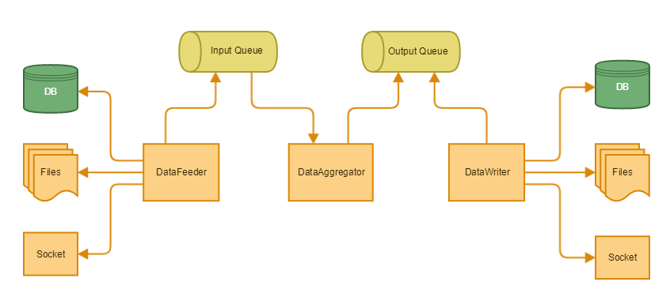
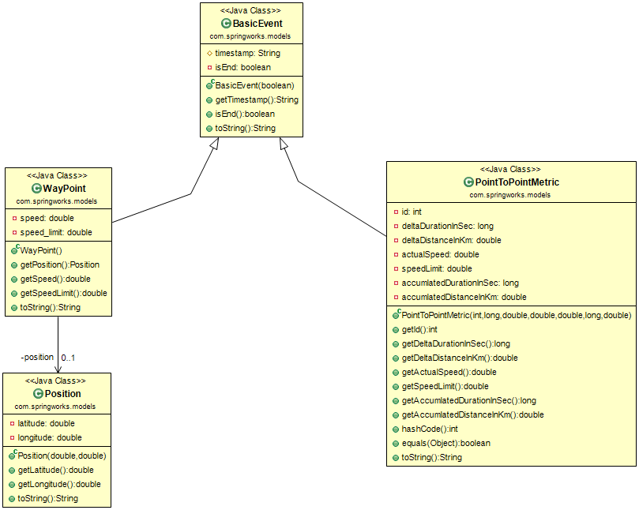

```{r setup, include=FALSE}
knitr::opts_chunk$set(echo = TRUE)
```

## Introduction

Through this article, I am going to explian how is architecture to build realtime non blocking waypoints data aggregator to calcaulate the following metrics to be used by Risky Insurances Inc. for calculating the insurance fee based on how well the driver stick to the speed limits while driving.


To clone the source code, visit <https://github.com/ashrafsarhan/waypoints-aggregator>.

##1. Project Environment
* JDK 1.8
* Apache Maven 3.3.9
* Google gson 2.8.0
* Junit 4.12
* Log4j 1.2.17

##2. Project Package Structure
* com.springworks.bootstrap
    + Contains the application (*Main*, *Initializer*) classes.
* com.springworks.common
    + Contains the common utils classes which are used across the code (*CsvFileWriter*, *GeoDistanceCalculator*, *NumberUtils*, *TimeCalculator*).
* com.springworks.models
    + Contains the data model POJO classes for the app (*BasicEvent*, *PointToPointMetric*, *Position*, *WayPoint*).
* com.springworks.stream.api/impl
    + Contains the *IDataFeeder* interface with a template abstract class *QueuedDataFeeder* with one concrete implementation *FileDataFeeder* which stream the waypoints file data to the *WayPointsAggregator* processor.
* com.springworks.processor.api/impl
    + Contains the *IDataProcessor* interface with a template abstract class *QueuedDataProcessor* with one concrete implementation *WayPointsAggregator* which provides the actual processing.
    
##3. Project Architecture (Figure 1)



##4. Project Class Diagrams (Figure 2,3)




##5. Project Testing/Running
There are some Junit cases to test the functionalities, which are running during the project build phase. After building all the projects, go to the target dir and you will find an excutable deployable fat jars (app-name.jar) which contains all the dependencies.

To build/run the project, run the following commands:

```
mnv clean install

java -jar waypoints-aggregator-0.0.1.jar waypoints.json
```

##6. References

[1] Calculate distance between two latitude-longitude points? (Haversine formula)

<https://stackoverflow.com/questions/27928/calculate-distance-between-two-latitude-longitude-points-haversine-formula>

[2] Haversine Formula - Calculate geographic distance on earth

<http://www.igismap.com/haversine-formula-calculate-geographic-distance-earth>

